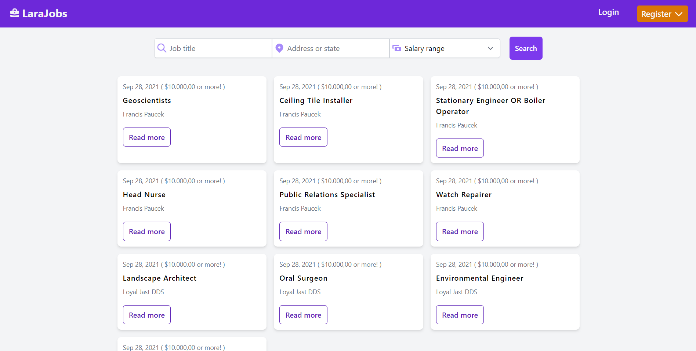

# Larajobs



## Description

Larajobs is a web application built with the tallstack, where user can look and apply for jobs and companies can post jobs opportunities so the users can apply to them.

## Main Features

### User features

-   Create a resume
-   Serach for jobs
-   Apply for jobs
-   Receive invites for job interviews

### Company features

-   Post a job opportunity
-   Invite users for job interviews

## Technology used

- PHP 8
- Laravel 8
- Tailwind 2
- Alpine.js

## Requirements

-   php: ^8.0
-   Laravel: ^8.0
-   Composer
-   npm

## Project Set up

1. First you need to clone this repo or download the zip and extract!
2. cd/get into your project
3. Install Composer Dependencies

```
composer install
```

4. Install NPM Dependencies

```
npm install
```

5. Create a copy of your .env file

```
cp .env.example .env
```

6. Generate an app encryption key

```
php artisan key:generate
```

7. Create an database for the application, and in the .env file, add database information
8. Migrate the database and seed the database

```
php artisan migrate --seed
```
